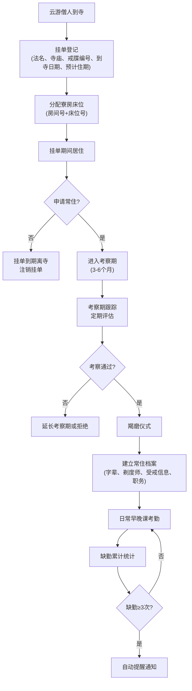

## 1. 产品概述

寺院僧人挂单与常住管理平台是一款专为佛教寺院设计的信息化管理系统，用于规范化管理云游僧人的挂单登记、寮房床位安排、常住僧人档案以及日常早晚课考勤。目标用户为寺院客堂知客、维那等管理人员，旨在提升寺院管理效率，实现僧团管理的数字化转型。

## 2. 核心功能

### 2.1 用户角色

| 角色 | 注册方式 | 核心权限 |
|------|----------|----------|
| 系统管理员 | 后台创建 | 全功能权限、用户管理、系统配置 |
| 客堂知客 | 管理员创建 | 挂单登记、寮房管理、常住档案管理 |
| 维那师 | 管理员创建 | 早晚课考勤登记、缺勤查询与提醒 |

### 2.2 功能模块

1. **挂单登记管理**：云游僧人挂单信息录入、查询、编辑、注销
2. **寮房床位管理**：房间/床位信息维护、挂单期间床位分配
3. **常住僧人管理**：考察期管理、羯磨仪式登记、常住档案维护
4. **早晚课考勤**：每日考勤登记、缺勤统计、自动提醒
5. **数据统计看板**：挂单人数、常住人数、出勤率等关键指标

### 2.3 页面详情

| 页面名称 | 模块名称 | 功能描述 |
|-----------|-------------|---------------------|
| 首页看板 | 数据统计 | 展示今日挂单数、在住人数、常住人数、出勤率等核心指标 |
| 挂单登记 | 挂单列表 | 挂单僧人列表展示、搜索、筛选、新增、编辑、注销 |
| 挂单登记 | 挂单表单 | 录入法名、出家寺庙、戒牒编号、到寺日期、预计住几天 |
| 寮房管理 | 房间列表 | 房间/床位信息展示、状态标识（空闲/已住） |
| 寮房管理 | 床位分配 | 为挂单僧人分配房间号和床位号 |
| 常住管理 | 考察期列表 | 考察期僧人列表、考察进度跟踪、到期提醒 |
| 常住管理 | 常住档案 | 常住僧人完整档案（法名、字辈、剃度师、受戒信息、职务） |
| 考勤管理 | 考勤登记 | 每日早晚课考勤登记（出勤/缺勤/请假） |
| 考勤管理 | 缺勤提醒 | 累计缺勤满3次自动提醒、缺勤记录查询 |

## 3. 核心流程

云游僧人到寺后，首先由客堂知客进行挂单登记，录入基本信息并分配寮房床位。挂单期间僧人如需常住，可进入3-6个月的考察期，考察通过后经羯磨仪式正式成为常住僧人，建立完整的常住档案。维那师每日进行早晚课考勤登记，系统自动统计缺勤次数，累计满3次自动提醒。

## 4. 用户界面设计

### 4.1 设计风格

- **主色调**：采用宁静典雅的暖黄色系（#D4A574）作为主色，体现佛教寺院的宁静与庄重
- **辅助色**：深棕色（#5D4E37）用于文字和边框，浅米色（#F5F0E6）作为背景
- **点缀色**：僧袍红（#8B2323）用于重要操作按钮和提醒标识
- **按钮风格**：圆角矩形按钮，悬停时有轻微的阴影和色彩变化
- **字体**：采用"思源宋体"作为标题字体，体现传统文化韵味；"思源黑体"作为正文字体，保证可读性
- **布局风格**：卡片式布局，顶部导航+侧边栏的经典管理后台结构
- **图标风格**：线性图标，简洁素雅，配合佛教元素（如莲花、木鱼等）

### 4.2 页面设计概述

| 页面名称 | 模块名称 | UI元素 |
|-----------|-------------|-------------|
| 首页看板 | 数据统计 | 卡片式数据展示、图标+数字、渐变色背景、数据趋势图表 |
| 挂单登记 | 挂单列表 | 表格布局、搜索筛选栏、操作按钮组、状态标签 |
| 挂单登记 | 挂单表单 | 模态框表单、分组布局、日期选择器、表单验证提示 |
| 寮房管理 | 房间列表 | 网格布局展示床位、色块区分状态、悬停显示详情 |
| 常住管理 | 档案卡片 | 左侧照片+基本信息、右侧详细档案、标签式分组展示 |
| 考勤管理 | 考勤日历 | 日历视图+考勤状态色块、快捷操作按钮 |

### 4.3 响应式

- 桌面端优先设计，适配1920px、1440px、1080px等主流分辨率
- 侧边栏可折叠，适配小屏幕设备
- 表格支持横向滚动，保证数据完整性
- 触摸优化：按钮最小点击区域40x40px，表单元素间距合理

### 4.4 视觉细节

- 页面背景采用浅米色渐变，营造宁静氛围
- 卡片添加轻微阴影和圆角，层次分明
- 关键数据使用大号字体和醒目颜色
- 状态标签使用不同背景色区分（绿色-正常、黄色-待处理、红色-警告）
- 页面切换使用淡入淡出过渡动画
