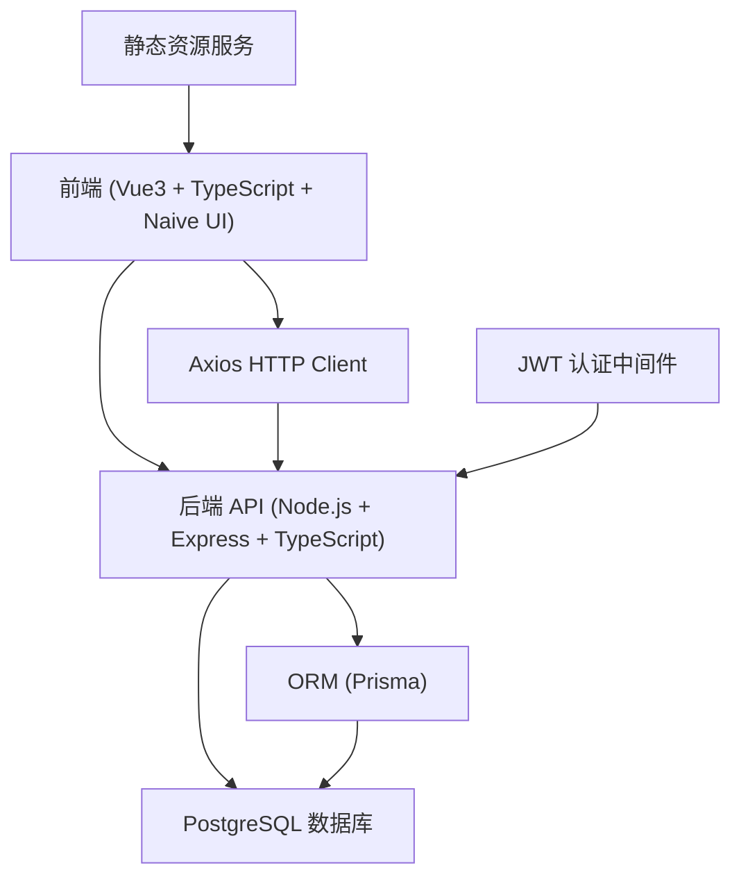
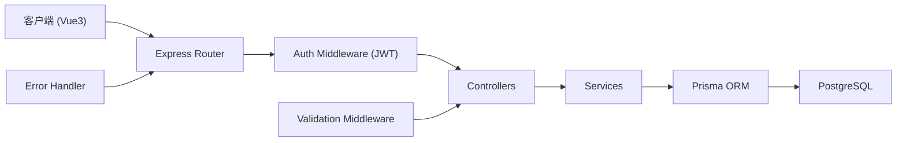
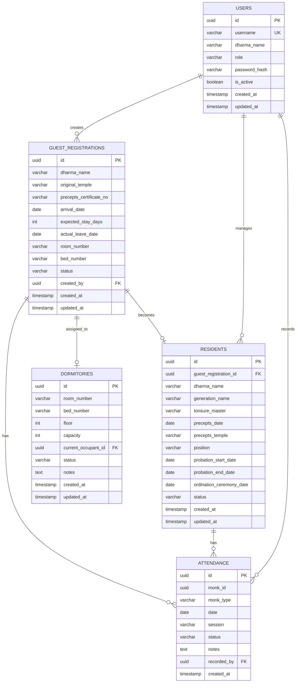

## 1. 架构设计



## 2. 技术描述

- **前端**：Vue 3.4 + TypeScript 5.4 + Naive UI 2.38 + Vite 5.2
- **状态管理**：Pinia 2.1
- **路由**：Vue Router 4.3
- **HTTP客户端**：Axios 1.7
- **后端**：Node.js 20 + Express 4.19 + TypeScript 5.4
- **ORM**：Prisma 5.14
- **数据库**：PostgreSQL 16
- **认证**：JWT (jsonwebtoken 9.0)
- **密码加密**：bcryptjs 2.4
- **日期处理**：dayjs 1.11
- **图表**：ECharts 5.5
- **初始化工具**：npm create vite@latest

## 3. 路由定义

| 路由 | 页面 | 权限 |
|-------|---------|------|
| /login | 登录页 | 公开 |
| /dashboard | 首页看板 | 需要登录 |
| /registration | 挂单登记列表 | 需要登录 |
| /registration/new | 新增挂单 | 需要登录 |
| /registration/:id | 挂单详情/编辑 | 需要登录 |
| /dormitory | 寮房管理 | 需要登录 |
| /residents | 常住僧人列表 | 需要登录 |
| /residents/probation | 考察期列表 | 需要登录 |
| /residents/:id | 常住档案详情 | 需要登录 |
| /attendance | 考勤管理 | 需要登录 |
| /attendance/records | 考勤记录查询 | 需要登录 |
| /users | 用户管理（管理员） | 管理员 |
| /settings | 系统设置（管理员） | 管理员 |

## 4. API 定义

### 4.1 TypeScript 类型定义

```typescript
// 挂单登记
interface GuestRegistration {
  id: string;
  dharmaName: string;           // 法名
  originalTemple: string;       // 出家寺庙
  preceptsCertificateNo: string; // 戒牒编号
  arrivalDate: Date;            // 到寺日期
  expectedStayDays: number;     // 预计住几天
  actualLeaveDate?: Date;       // 实际离寺日期
  roomNumber?: string;          // 房间号
  bedNumber?: string;           // 床位号
  status: 'active' | 'checked_out' | 'probation' | 'resident';
  createdAt: Date;
  updatedAt: Date;
}

// 常住僧人
interface Resident {
  id: string;
  guestRegistrationId?: string;
  dharmaName: string;           // 法名
  generationName: string;       // 字辈
  tonsureMaster: string;        // 剃度师
  preceptsDate: Date;           // 受戒时间
  preceptsTemple: string;       // 戒场
  position?: string;            // 担任职务（知客/维那/典座等）
  probationStartDate: Date;     // 考察期开始日期
  probationEndDate?: Date;      // 考察期结束日期
  ordinationCeremonyDate?: Date; // 羯磨仪式日期
  status: 'probation' | 'active' | 'suspended' | 'left';
  createdAt: Date;
  updatedAt: Date;
}

// 寮房
interface Dormitory {
  id: string;
  roomNumber: string;           // 房间号
  bedNumber: string;            // 床位号
  floor: number;
  capacity: number;
  currentOccupantId?: string;   // 当前住客ID
  status: 'available' | 'occupied' | 'maintenance';
  notes?: string;
}

// 考勤记录
interface Attendance {
  id: string;
  monkId: string;               // 僧人ID（可指向挂单或常住）
  monkType: 'guest' | 'resident';
  date: Date;
  session: 'morning' | 'evening'; // 早课/晚课
  status: 'present' | 'absent' | 'leave';
  notes?: string;
  createdAt: Date;
}

// 用户
interface User {
  id: string;
  username: string;
  dharmaName: string;
  role: 'admin' | 'receptionist' | 'chanting_master';
  passwordHash: string;
  isActive: boolean;
  createdAt: Date;
}
```

### 4.2 API 接口列表

| 方法 | 路径 | 描述 | 权限 |
|------|------|------|------|
| POST | /api/auth/login | 用户登录 | 公开 |
| GET | /api/auth/me | 获取当前用户信息 | 需要登录 |
| GET | /api/dashboard/stats | 获取首页统计数据 | 需要登录 |
| GET | /api/registrations | 获取挂单列表 | 需要登录 |
| POST | /api/registrations | 新增挂单登记 | 需要登录 |
| GET | /api/registrations/:id | 获取挂单详情 | 需要登录 |
| PUT | /api/registrations/:id | 更新挂单信息 | 需要登录 |
| DELETE | /api/registrations/:id | 注销挂单 | 需要登录 |
| PUT | /api/registrations/:id/assign-bed | 分配床位 | 需要登录 |
| POST | /api/registrations/:id/start-probation | 开始考察期 | 需要登录 |
| GET | /api/dormitories | 获取寮房列表 | 需要登录 |
| POST | /api/dormitories | 新增寮房 | 管理员 |
| PUT | /api/dormitories/:id | 更新寮房信息 | 管理员 |
| GET | /api/residents | 获取常住列表 | 需要登录 |
| GET | /api/residents/probation | 获取考察期列表 | 需要登录 |
| POST | /api/residents | 新增常住档案 | 需要登录 |
| GET | /api/residents/:id | 获取常住详情 | 需要登录 |
| PUT | /api/residents/:id | 更新常住档案 | 需要登录 |
| PUT | /api/residents/:id/complete-probation | 完成考察期 | 需要登录 |
| GET | /api/attendance | 获取考勤记录 | 需要登录 |
| POST | /api/attendance/batch | 批量登记考勤 | 需要登录 |
| GET | /api/attendance/absent-count | 获取僧人缺勤统计 | 需要登录 |
| GET | /api/attendance/absent-alerts | 获取缺勤提醒列表 | 需要登录 |

## 5. 服务器架构图



## 6. 数据模型

### 6.1 ER 图



### 6.2 DDL 语句

```sql
-- 启用 UUID 扩展
CREATE EXTENSION IF NOT EXISTS "uuid-ossp";

-- 用户表
CREATE TABLE users (
    id UUID PRIMARY KEY DEFAULT uuid_generate_v4(),
    username VARCHAR(50) UNIQUE NOT NULL,
    dharma_name VARCHAR(100) NOT NULL,
    role VARCHAR(20) NOT NULL CHECK (role IN ('admin', 'receptionist', 'chanting_master')),
    password_hash VARCHAR(255) NOT NULL,
    is_active BOOLEAN DEFAULT true,
    created_at TIMESTAMP DEFAULT CURRENT_TIMESTAMP,
    updated_at TIMESTAMP DEFAULT CURRENT_TIMESTAMP
);

-- 寮房表
CREATE TABLE dormitories (
    id UUID PRIMARY KEY DEFAULT uuid_generate_v4(),
    room_number VARCHAR(20) NOT NULL,
    bed_number VARCHAR(20) NOT NULL,
    floor INTEGER NOT NULL,
    capacity INTEGER DEFAULT 1,
    current_occupant_id UUID,
    status VARCHAR(20) NOT NULL DEFAULT 'available' CHECK (status IN ('available', 'occupied', 'maintenance')),
    notes TEXT,
    created_at TIMESTAMP DEFAULT CURRENT_TIMESTAMP,
    updated_at TIMESTAMP DEFAULT CURRENT_TIMESTAMP,
    UNIQUE(room_number, bed_number)
);

-- 挂单登记表
CREATE TABLE guest_registrations (
    id UUID PRIMARY KEY DEFAULT uuid_generate_v4(),
    dharma_name VARCHAR(100) NOT NULL,
    original_temple VARCHAR(200) NOT NULL,
    precepts_certificate_no VARCHAR(100) UNIQUE,
    arrival_date DATE NOT NULL,
    expected_stay_days INTEGER NOT NULL,
    actual_leave_date DATE,
    room_number VARCHAR(20),
    bed_number VARCHAR(20),
    status VARCHAR(20) NOT NULL DEFAULT 'active' CHECK (status IN ('active', 'checked_out', 'probation', 'resident')),
    created_by UUID REFERENCES users(id),
    created_at TIMESTAMP DEFAULT CURRENT_TIMESTAMP,
    updated_at TIMESTAMP DEFAULT CURRENT_TIMESTAMP
);

-- 常住僧人表
CREATE TABLE residents (
    id UUID PRIMARY KEY DEFAULT uuid_generate_v4(),
    guest_registration_id UUID REFERENCES guest_registrations(id),
    dharma_name VARCHAR(100) NOT NULL,
    generation_name VARCHAR(50) NOT NULL,
    tonsure_master VARCHAR(100) NOT NULL,
    precepts_date DATE NOT NULL,
    precepts_temple VARCHAR(200) NOT NULL,
    position VARCHAR(50),
    probation_start_date DATE NOT NULL,
    probation_end_date DATE,
    ordination_ceremony_date DATE,
    status VARCHAR(20) NOT NULL DEFAULT 'probation' CHECK (status IN ('probation', 'active', 'suspended', 'left')),
    created_at TIMESTAMP DEFAULT CURRENT_TIMESTAMP,
    updated_at TIMESTAMP DEFAULT CURRENT_TIMESTAMP
);

-- 考勤表
CREATE TABLE attendance (
    id UUID PRIMARY KEY DEFAULT uuid_generate_v4(),
    monk_id UUID NOT NULL,
    monk_type VARCHAR(20) NOT NULL CHECK (monk_type IN ('guest', 'resident')),
    date DATE NOT NULL,
    session VARCHAR(10) NOT NULL CHECK (session IN ('morning', 'evening')),
    status VARCHAR(20) NOT NULL CHECK (status IN ('present', 'absent', 'leave')),
    notes TEXT,
    recorded_by UUID REFERENCES users(id),
    created_at TIMESTAMP DEFAULT CURRENT_TIMESTAMP,
    UNIQUE(monk_id, date, session)
);

-- 创建索引
CREATE INDEX idx_guest_registrations_status ON guest_registrations(status);
CREATE INDEX idx_guest_registrations_arrival_date ON guest_registrations(arrival_date);
CREATE INDEX idx_residents_status ON residents(status);
CREATE INDEX idx_attendance_date ON attendance(date);
CREATE INDEX idx_attendance_monk ON attendance(monk_id, monk_type);
CREATE INDEX idx_dormitories_status ON dormitories(status);

-- 创建更新时间触发器函数
CREATE OR REPLACE FUNCTION update_updated_at_column()
RETURNS TRIGGER AS $$
BEGIN
    NEW.updated_at = CURRENT_TIMESTAMP;
    RETURN NEW;
END;
$$ LANGUAGE plpgsql;

-- 为各表添加更新时间触发器
CREATE TRIGGER update_users_updated_at BEFORE UPDATE ON users
    FOR EACH ROW EXECUTE FUNCTION update_updated_at_column();
CREATE TRIGGER update_dormitories_updated_at BEFORE UPDATE ON dormitories
    FOR EACH ROW EXECUTE FUNCTION update_updated_at_column();
CREATE TRIGGER update_guest_registrations_updated_at BEFORE UPDATE ON guest_registrations
    FOR EACH ROW EXECUTE FUNCTION update_updated_at_column();
CREATE TRIGGER update_residents_updated_at BEFORE UPDATE ON residents
    FOR EACH ROW EXECUTE FUNCTION update_updated_at_column();

-- 插入初始管理员用户 (密码: admin123456)
INSERT INTO users (username, dharma_name, role, password_hash) VALUES 
('admin', '系统管理员', 'admin', '$2a$10$N9qo8uLOickgx2ZMRZoMyeIjZAgcfl7p92ldGxad68LJZdL17lhWy');

-- 插入示例寮房数据
INSERT INTO dormitories (room_number, bed_number, floor, capacity) VALUES 
('101', '1', 1, 1),
('101', '2', 1, 1),
('101', '3', 1, 1),
('102', '1', 1, 1),
('102', '2', 1, 1),
('201', '1', 2, 1),
('201', '2', 2, 1),
('202', '1', 2, 1),
('202', '2', 2, 1),
('301', '1', 3, 1),
('301', '2', 3, 1);
```
